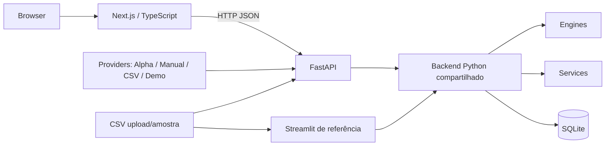
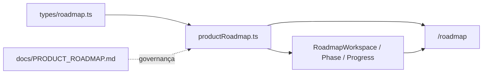

# Arquitetura

## Visão geral

O XAU AI TERMINAL é um monólito modular em migração gradual de interface. A camada
Python de domínio é única e atende duas superfícies:

1. FastAPI, consumido pelo frontend Next.js;
2. Streamlit, mantido como referência funcional.



## Estrutura

```text
XAU_AI_TERMINAL_V3/
├── app.py
├── backend/
│   ├── main.py
│   ├── api/
│   ├── core/
│   ├── database/
│   ├── models/
│   ├── providers/
│   ├── schemas/
│   ├── services/
│   └── tests/
├── frontend/
│   ├── app/
│   ├── components/
│   ├── lib/
│   └── types/
├── xau_ai_terminal/
│   ├── constants.py
│   ├── models/
│   ├── ui/
│   ├── utils/
│   └── views/
├── tests/
├── data/
├── database/
└── docs/
```

## Backend

### Bootstrap

`backend/main.py`:

- cria a aplicação FastAPI;
- inicializa o schema SQLite no lifespan;
- configura CORS para `localhost:3000` e `127.0.0.1:3000`;
- registra routers sob `/api`;
- publica OpenAPI em `/api/docs`.

### API

| Router | Endpoint | Responsabilidade |
|---|---|---|
| `health.py` | `GET /api/health` | Saúde, nome e versão |
| `analysis.py` | `POST /api/analysis/demo` | Analisa o CSV demonstrativo |
| `analysis.py` | `POST /api/analysis/upload` | Valida e analisa upload |
| `history.py` | `GET /api/history` | Lê histórico SQLite |
| `settings.py` | `GET /api/settings` | Capacidades atuais do runtime |
| `snapshots.py` | `/api/snapshots*` | CRUD e reconstrução de snapshots |
| `open_interest.py` | `GET /api/open-interest` | Métricas OI da amostra |
| `gex.py` | `GET /api/gex` | Perfil Gamma Exposure da amostra |
| `market_data.py` | `/api/providers*`, `/api/market/*` | Providers, metadata, spot, histórico, opções e importação |

Pydantic models em `backend/schemas/` definem o contrato HTTP. Models em
`backend/models/` representam o domínio interno.

### Domínio compartilhado

`backend/core/` contém a única cópia dos engines. O Open Interest Engine foi
adicionado e Gamma, Dealer e Commentary receberam APIs V2 aditivas. Os métodos e
resultados Gamma V1 permanecem protegidos por teste comparativo.

O Open Interest Engine fornece um contrato próprio com distribuição, Top 10 e
score HHI. A camada API acrescenta esse contexto ao Dealer Report; o Dealer
Engine não foi modificado.

O `GammaExposureEngine` compõe o Gamma Engine protegido. Ele não duplica nem
reescreve sua fórmula: agrega a saída por strike, calcula GEX bruto, extremos,
pressão normalizada e metadados da origem do gamma. A camada API incorpora esse
contexto ao Dealer Report sem alterar o Dealer Engine.

`backend/services/institutional_analysis_service.py` orquestra loader, engines e
models. Tanto a API quanto o Streamlit usam esse serviço.

### Providers e normalização

`backend/providers/` isola integrações externas e arquivos autorizados:

- `interface_provider.py`: contrato comum;
- `models.py`: spot, contratos, cadeia e metadata normalizados;
- `provider_factory.py` e `provider_registry.py`: seleção/capacidades/fallback;
- `provider_cache.py`: cache TTL em memória;
- `provider_errors.py`: falhas públicas sanitizadas;
- `alpha_vantage_provider.py`: integração oficial opcional;
- `manual_options_provider.py`: validação e confirmação de upload;
- `csv_provider.py` e `demo_provider.py`: fontes preservadas.

O frontend consome apenas a API FastAPI. A chave Alpha Vantage nunca entra em
bundles Next.js. A factory tenta somente fontes autorizadas e informa sempre a
origem efetiva.

### SQLite

- arquivo: `database/xau_terminal.db`;
- conexão/schema: `backend/database/connection.py`;
- consultas: `backend/database/repositories.py`.

`institutional_levels` permanece como histórico legado somente leitura.
`institutional_snapshots` persiste o resultado completo da análise e metadados
indexados. A implementação está separada em `SnapshotEngine`,
`snapshot_service.py` e `snapshot_repository.py`.

## Frontend

O frontend web 4.0 usa Next.js App Router e separa:

- `app/`: rotas;
- `components/layout`: shell, sidebar, headers e estados;
- `components/cards`: métricas, badges e painel de alertas;
- `components/charts`: perfil, mapa GEX, curva de Gamma e distribuição OI;
- `components/tables`: strikes e histórico;
- `components/institutional`: dashboard, upload, Dealer Report e confiança;
- `components/snapshots`: listagem, ações e comparação;
- `components/copilot`: chat, histórico, sugestões e respostas estruturadas;
- `components/roadmap`: timeline, fases, dependências e progresso declarativo;
- `components/workspace`: telemetria dos providers e importação manual;
- `lib/copilot`: Knowledge Engine, contexto, persistência e providers;
- `lib/productRoadmap.ts`: fonte única dos marcos, status e critérios de produto;
- `lib/api.ts`: cliente HTTP central;
- `lib/useRemoteResource.ts`: carregamento remoto e retry;
- `lib/alerts.ts`: alertas derivados do contrato real;
- `lib/formatters.ts`: formatação;
- `lib/constants.ts`: navegação e URL da API;
- `types/`: contratos TypeScript equivalentes aos schemas Pydantic.
- `types/roadmap.ts`: contrato tipado do Product Roadmap.

Detalhes visuais e responsivos estão em [FRONTEND.md](FRONTEND.md).

### Institutional Copilot

`/copilot` reutiliza exclusivamente dados presentes em `AnalysisResponse` e
snapshots. `KnowledgeContext` separa Dealer Report, Replay, Heatmap, Analytics,
AI Summary, Open Interest, GEX, Gamma e Volatility. O
`KnowledgeEngineProvider` interpreta perguntas por regras locais e devolve
seções acompanhadas dos indicadores efetivamente consultados.

A UI depende de `CopilotProvider`, não da implementação local. Assim, um
provider futuro pode conectar um LLM por meio de uma camada servidora sem
alterar componentes, histórico ou formato da resposta. Consulte
[COPILOT.md](COPILOT.md).

### Product Roadmap

`/roadmap` é uma superfície exclusivamente frontend e documental. A rota
renderiza dados estáticos tipados de `lib/productRoadmap.ts` por componentes
reutilizáveis em `components/roadmap/`. Não chama API, não persiste estado e não
participa de cálculos institucionais.



O status operacional é separado do status de implementação: providers e
configurações podem existir no código sem que uma consulta externa ou deploy
seja marcado como concluído. O documento principal é
[PRODUCT_ROADMAP.md](PRODUCT_ROADMAP.md); [ROADMAP.md](ROADMAP.md) funciona como
índice técnico para evitar duas fontes narrativas concorrentes.

### Extensão do contrato 4.0

`POST /api/analysis/demo` e `POST /api/analysis/upload` preservam todos os
campos anteriores e adicionam metadados de apresentação:

| Campo | Responsabilidade |
|---|---|
| `report` | Texto estruturado do Dealer Report |
| `price_change_percent` | Reservado para cotação real; atualmente `null` |
| `source_name` | Nome seguro da origem analisada |
| `source_mode` | `demo` ou `upload` |
| `generated_at` | Horário UTC de processamento |
| `source_updated_at` | Modificação conhecida da amostra |
| `source_is_stale` | Amostra local com mais de 24 horas |

Esses campos não participam dos cálculos de gamma. O frontend deriva apenas
ordenação, escalas visuais, strike dominante e severidades de interface.

### Extensão institucional V2

Os mesmos endpoints de análise adicionam `open_interest_summary`,
`open_interest_analysis`, `gamma_summary`, `gamma_exposure_analysis`,
`dealer_report` e `strike_table`. Não houve remoção ou renomeação dos campos V4.
As regras estão em [ENGINES.md](ENGINES.md) e o contrato detalhado em
[API.md](API.md).

### Snapshots

Cada análise HTTP concluída é salva antes da resposta. `analysis_json` permite
reconstruir o mesmo `AnalysisResponse`; os engines não são reexecutados ao abrir
um snapshot. Consulte [SNAPSHOTS.md](SNAPSHOTS.md).

O JSON de snapshots da Sprint 3 inclui `gamma_exposure_analysis` completo.
O campo é opcional no contrato para preservar a leitura de snapshots anteriores.

## Streamlit preservado

`app.py` e `xau_ai_terminal/` continuam executáveis. Somente módulos específicos da
interface permanecem nesse pacote:

- textos e estilos Streamlit;
- components Streamlit;
- views;
- models de UI;
- formatadores.

Engines, serviços e banco não foram duplicados: os imports apontam para `backend/`.

## Configuração

### Backend

| Variável | Default |
|---|---|
| `XAU_DATABASE_PATH` | `database/xau_terminal.db` |
| `XAU_SAMPLE_CSV_PATH` | `data/sample_options.csv` |
| `XAU_OUTPUT_DIR` | `outputs/` |
| `XAU_CORS_ORIGINS` | origins locais do frontend |
| `MARKET_DATA_PROVIDER` | `auto` |
| `ALPHA_VANTAGE_API_KEY` | vazio; backend only |
| `MARKET_DATA_CACHE_SECONDS` | `60` |
| `MARKET_DATA_TIMEOUT_SECONDS` | `10` |
| `ALLOW_DEMO_FALLBACK` | `true` |
| `MARKET_DATA_CSV_PATH` | vazio |

### Frontend

| Variável | Default |
|---|---|
| `NEXT_PUBLIC_API_URL` | `http://localhost:8000/api` |

## Dependências

```text
Next.js UI -> FastAPI HTTP -> Services -> Engines
Streamlit UI -------------> Services -> Engines
FastAPI -> Snapshot Service -> Snapshot Repository -> SQLite
FastAPI/Streamlit --------> Database repositories -> SQLite
```

Engines não importam interface, FastAPI ou SQLite.

## Limitações preservadas

- sem dados em tempo real;
- spot/histórico externos somente quando uma chave válida estiver configurada;
- cadeia completa de opções ao vivo indisponível no plano gratuito integrado;
- dados Alpha são classificados conservadoramente como atrasados/históricos;
- sem scraping de páginas Cboe ou endpoints não documentados;
- preço e variação retornam `null`;
- histórico legado sem gravação; snapshots completos com gravação;
- mudança de regime sem série temporal persistida;
- score e confiança são heurísticos e direcionais;
- Gamma Flip sem curva completa/spot é estimado;
- fórmulas GEX V1 inalteradas e extensões V2 aditivas;
- Alert e Market Engine continuam limitados às regras existentes.

### CME Daily Bulletin Provider

`CmeBulletinService` coordena o fluxo manual de duas etapas (preview e
confirmação). `CmeBulletinParser` extrai texto nativo/coordenadas de todas as
páginas da Section 64, `CmeBulletinValidator` classifica a importação e aplica
o gate de elegibilidade, e `CmeBulletinProvider` expõe somente o resultado
confirmado. O PDF nunca é salvo no SQLite; são persistidos hash, metadata,
relatório e contratos rastreáveis por página/linha. O provider é
`end_of_day`/manual e não altera a Provider Factory ou os engines protegidos.
O repositório usa a tabela SQLite `cme_bulletin_imports` para hash, relatório,
metadata, alinhamento e contratos normalizados; o PDF bruto não é persistido.
