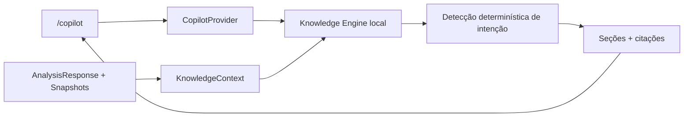

# Institutional Copilot

## Objetivo

O Institutional Copilot responde perguntas sobre o estado já processado pelo
XAU AI Terminal. A primeira implementação não usa OpenAI, Claude, rede externa
ou geração probabilística. Toda resposta é produzida pelo `Knowledge Engine`
com regras determinísticas.

## Fontes aceitas

- Dealer Report;
- Replay e snapshots;
- Heatmap por strike;
- Analytics;
- AI Market Summary;
- Open Interest;
- GEX;
- Gamma;
- Volatility.

O contexto é construído a partir de um `AnalysisResponse` existente e da lista
de snapshots. Na abertura, o frontend reutiliza o snapshot mais recente. Se
nenhum snapshot existir, utiliza o provider de opções configurado.

## Fluxo



O engine só cria uma seção quando os campos necessários estão presentes e são
válidos. Valores nulos, `NaN` ou infinitos não são convertidos em estimativas.
Quando nenhuma seção pode ser construída, a resposta é exatamente:

> Não há dados suficientes.

## Contrato da resposta

Cada resposta contém:

- `status`: `answered` ou `insufficient`;
- `summary`: resumo seguro;
- `sections`: blocos estruturados;
- `citations`: indicadores internos efetivamente utilizados;
- `generatedAt`: horário da resposta.

As citações informam o indicador, a origem do arquivo e, quando disponível, o
snapshot usado.

## Histórico

Conversas e mensagens são persistidas somente no LocalStorage do navegador,
sob a chave `xau-terminal.copilot-history.v1`. A leitura valida tipos, datas,
papéis, tamanho das mensagens e nomes das citações. O limite atual é de 20
conversas e 100 mensagens por conversa.

Nenhum contexto de mercado, CSV ou segredo é salvo pelo Copilot no navegador.

## Providers futuros

A interface `CopilotProvider` expõe:

```text
answer(request)
getMetadata()
isAvailable()
```

O `providerFactory` retorna `KnowledgeEngineProvider` por padrão. Um adaptador
futuro para GPT, Claude ou outro LLM deverá:

1. implementar `CopilotProvider`;
2. receber o mesmo `KnowledgeContext`;
3. devolver o mesmo `CopilotAnswer`;
4. ser registrado por `registerCopilotProvider`;
5. ser selecionado por `NEXT_PUBLIC_COPILOT_PROVIDER`.

A variável pública seleciona apenas o identificador do provider e nunca deve
conter chaves ou segredos. Credenciais futuras devem permanecer em uma camada
servidora.

Essa composição mantém a rota, os componentes, o histórico e o formato visual
inalterados ao trocar a tecnologia de resposta.
