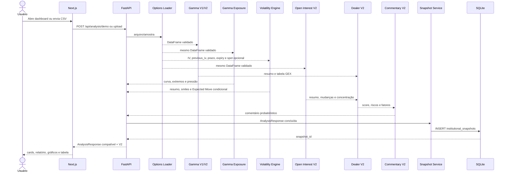

# Fluxo de dados

## Next.js + FastAPI



O DataFrame é carregado uma vez. Gamma, Gamma Exposure, OI e Volatility são
calculados no backend; o frontend somente formata, ordena e representa os
valores.

O Open Interest Engine produz:

```text
CSV validado
 -> agregação Call/Put por strike
 -> Total e Net OI
 -> percentual por strike
 -> Top 10
 -> maior concentração
 -> score HHI
```

`GET /api/open-interest` executa esse fluxo na amostra sem criar snapshot.

O Gamma Exposure Engine compõe o resultado protegido:

```text
GammaEngine.calculate()
 -> Call/Put/Net GEX por strike
 -> Total GEX bruto e acumulado
 -> extremos e Dealer Pressure
 -> curva_by_strike
```

`GET /api/gex` executa esse fluxo na amostra sem criar snapshot.

O fluxo de volatilidade é:

```text
iv / previous_iv
 -> conversão decimal ou percentual
 -> remoção de valores inválidos
 -> médias, skew, extremos e variações
 -> curvas por expiry + strike
spot + IV + prazo válidos
 -> Expected Move
```

`GET /api/volatility` executa o fluxo na amostra sem criar snapshot.

## Entrada CSV

Obrigatórias:

| Coluna | Regra |
|---|---|
| `strike` | finito e maior que zero |
| `type` | CALL ou PUT após normalização |
| `open_interest` | finito e não negativo |
| `volume` | finito e não negativo |

Opcionais consumidas pela V2:

| Coluna | Comportamento |
|---|---|
| `previous_open_interest` | não negativo; ausência produz mudanças zero |
| `gamma` | ausente/não positiva usa estimativa legada |
| `iv`, `days_to_expiry` | alimentam a estimativa legada de gamma |
| `aggressor` | participa do score quando numérico e diferente de zero |

Aliases `oi`, `previous_oi`, `prior_open_interest`, `vol` e outros continuam
normalizados pelo loader.

## Demo e upload

```text
Demo:   data/sample_options.csv -> loader -> análise
Upload: FormData -> UploadFile.file -> loader -> mesma análise
```

Extensão diferente de `.csv` retorna 415. Fonte ausente retorna 404. Estrutura ou
domínio inválido retorna 422. Nenhum upload é persistido.

## Contrato de análise

```text
AnalysisResponse
├── campos V4 preservados
│   ├── walls, gamma_flip, gamma_magnet, gex_total
│   ├── regime, dealer_bias, confidence, volatility
│   ├── commentary, decision, report, alerts
│   └── gex_by_strike e metadados da fonte
├── open_interest_summary
├── open_interest_analysis
├── gamma_summary
├── gamma_exposure_analysis
│   ├── totais, extremos, pressão e origem do gamma
│   └── curve_by_strike completa
├── volatility_analysis
│   ├── resumo IV e Expected Move
│   └── curvas por strike e vencimento
├── dealer_report
└── strike_table
    ├── GEX atual + acumulado
    └── OI atual, anterior, mudança e concentração
```

## Dashboard V4 com inteligência V2

```text
AnalysisResponse
├── Header: status, origem e atualização
├── Linha V4 1: regime, bias, confiança, risco, GEX
├── Linha V4 2: walls, flip, magnet, maior Net GEX
├── Linha adicional V2: score, intensidade, riscos, Call/Put OI
├── Bloco GEX: cards e curva por strike
├── Bloco IV: cinco cards, Volatility Smile e aviso histórico
├── Dealer Report: comentário, ação, fatores e contextos OI/GEX
├── Perfil/mapa: GEX bilateral, concentração e pressão
└── Tabela: strike_table; alertas: alerts
```

Preço e variação continuam `null`. O frontend mostra ausência de feed em vez de
criar cotações.

## Snapshots

```text
Análise concluída
 -> SnapshotEngine normaliza e serializa
 -> SnapshotRepository persiste metadados + analysis_json
 -> AnalysisResponse recebe snapshot_id

Página Snapshots
 -> GET /api/snapshots
 -> seleção de registro
 -> GET /api/snapshots/{id}
 -> Dashboard recebe AnalysisResponse salva
```

A comparação carrega dois detalhes e calcula deltas de apresentação no
frontend, incluindo Call/Put OI, score e concentração. Nenhum engine é executado
nesse fluxo.

Snapshots Sprint 3 preservam `gamma_exposure_analysis`; a comparação também
calcula deltas de Call/Put/GEX bruto, pressão e Gamma Magnet. Snapshots antigos
continuam válidos e exibem “—” para o bloco ausente.

Snapshots Sprint 4 preservam `volatility_analysis` dentro de `analysis_json`.
A comparação inclui IV ponderada, Call/Put IV, skew e Expected Move disponível.
O campo opcional mantém snapshots anteriores legíveis sem recálculo.

## Histórico, settings e Streamlit

```text
GET /api/history -> repository -> SQLite -> HistoryRecord[]
GET /api/settings -> capacidades estáticas do runtime
GET /api/health -> saúde, nome e versão
Streamlit -> serviço Python compartilhado -> mesmos engines
```

O histórico `institutional_levels` permanece somente leitura. As análises reais
concluídas pela API são gravadas em `institutional_snapshots`.

## Tratamento de erros

| Camada | Comportamento |
|---|---|
| Loader | lança exceção de domínio descritiva |
| FastAPI | converte falhas previstas em 404/415/422 |
| Pydantic | garante limites e tipos do JSON |
| Cliente HTTP | transforma não-2xx em `ApiError` |
| Next.js | apresenta loading, vazio, erro e retry |
| Streamlit | mantém tratamento e logging existentes |
