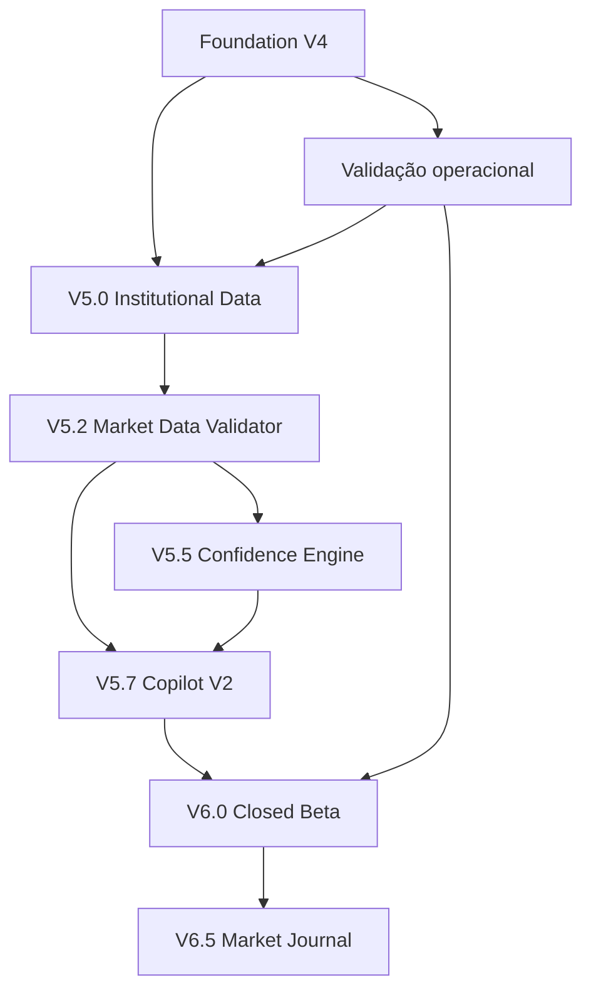

# XAU AI TERMINAL

## Institutional Intelligence Platform

## Missão

> “Transformar dados complexos do mercado de opções em análises claras,
> explicáveis e acionáveis para traders.”

## Visão

Construir uma plataforma modular de inteligência institucional que combine:

1. Quant Engine;
2. Data Acquisition Layer;
3. Knowledge Engine;
4. Institutional Copilot;
5. Market Replay;
6. Institutional Academy;
7. Market Journal.

A plataforma deve apoiar interpretação e decisão mantendo origem, freshness,
risco e limitações visíveis. O roadmap não representa promessa de data,
desempenho ou resultado financeiro.

## Status

| Status | Significado |
|---|---|
| Concluído | Existe no projeto e possui validação automatizada |
| Em validação | Implementação/configuração existe, mas falta evidência operacional |
| Em desenvolvimento | Parte da capacidade existe; versão completa ainda não |
| Planejado | Escopo e dependências definidos, sem implementação da versão |
| Futuro | Visão posterior, sem compromisso imediato |
| Bloqueado | Dependência impede avanço verificável |

Progresso é declarativo. Não é calculado automaticamente pela presença de
arquivos e não equivale a prazo.

## Dependências

## Estado atual — Foundation V4

Status: **Concluído**  
Progresso declarado: **100%**

Recursos presentes e validados no projeto:

- Dashboard Institucional;
- AI Market Summary;
- Gamma e Gamma Exposure Engines;
- Dealer Engine;
- Open Interest Engine;
- Volatility Engine;
- Snapshots;
- Market Replay;
- Heatmap;
- Analytics;
- Histórico;
- Institutional Academy;
- Institutional Copilot local;
- pesquisa global;
- Favoritos;
- Preferências;
- tela de Sistema;
- Provider Factory frontend e backend;
- CSV Provider;
- Demo Provider;
- Manual Options Provider;
- Alpha Vantage Provider implementado e testado com mocks;
- metadata, freshness, fallback explícito e cache TTL;
- testes automatizados de frontend e backend.

Critérios atendidos:

- rotas e componentes disponíveis;
- contratos atuais preservados;
- engines quantitativos protegidos por regressão e hashes;
- lint, TypeScript, build, Ruff e Pytest aprovados;
- dados demonstrativos, manuais e atrasados não são rotulados como tempo real.

Limitações:

- Option Chain real automática ainda não está disponível;
- engines institucionais dependem de CSV, importação manual ou demo;
- spot externo não é injetado automaticamente nos engines;
- confiança atual é heurística e ainda não possui decomposição auditável.

## Foundation — validação operacional

Status: **Em validação**  
Progresso declarado: **60%**

A capacidade de consultar spot XAU e histórico diário existe no provider Alpha
Vantage quando uma chave backend válida é configurada. O spot não é garantido
como tempo real e deve carregar a classificação informada pela metadata.

Também existem instruções para frontend Vercel e backend Render. Entretanto,
esta auditoria não encontrou chave válida, URL Render comprovada ou evidência
suficiente para marcar os deploys como concluídos.

Critérios para concluir:

- consulta controlada aprovada com chave válida;
- freshness, atraso e horário conferidos;
- health checks de Vercel e Render aprovados;
- nenhuma chave presente no frontend ou Git;
- fallback continua identificando a fonte efetiva.

## V5.0 — Institutional Data

Status: **Em desenvolvimento**  
Progresso declarado: **25%**

### Objetivo

Alimentar os engines com cadeias de opções legítimas, validadas, rastreáveis e
reproduzíveis.

### Entregas

- importador profissional de Option Chain;
- parser universal;
- mapeamento de colunas;
- suporte a diferentes layouts;
- validação de contratos;
- normalização;
- preview e confirmação;
- relatório de erros;
- histórico e comparação de importações;
- identificação da fonte;
- controle de freshness;
- vínculo entre spot e Option Chain;
- proteção contra arquivo incompatível.

O importador atual já fornece validação, preview e confirmação para o formato
normalizado. Parser universal, mapping assistido e histórico dedicado ainda não
existem.

### Critérios de conclusão

- arquivo válido processado integralmente;
- arquivo inválido não altera o estado;
- metadata preservada;
- snapshot registra a fonte;
- engines recebem somente dados validados;
- resultado reproduzível;
- testes automatizados aprovados.

## V5.2 — Market Data Validator

Status: **Planejado**

### Objetivo

Validar consistência, compatibilidade e suficiência antes de executar os
engines.

### Verificações planejadas

- spot compatível com o ativo;
- timestamp da cadeia;
- vencimentos e strikes válidos;
- Calls e Puts identificadas;
- Open Interest e volume não negativos;
- Gamma e IV válidos;
- contratos duplicados;
- strikes ausentes;
- divergência entre spot da cadeia e spot externo;
- dados desatualizados;
- quantidade mínima de contratos;
- campos críticos ausentes.

Classificações: **válido**, **válido com avisos**, **parcial**,
**incompatível** e **rejeitado**.

O validator nunca deve substituir valores ausentes por zero silenciosamente.

### Critérios de conclusão

- falha crítica bloqueia execução;
- avisos e razões são auditáveis;
- tolerâncias são documentadas por ativo/fonte;
- casos extremos possuem testes determinísticos.

## V5.5 — Confidence Engine

Status: **Planejado**

### Objetivo

Transformar confiança em uma métrica explicável, versionada e auditável.

### Contrato conceitual

A confiança poderá considerar, quando disponíveis:

- Gamma, GEX e Dealer Bias;
- Open Interest e IV;
- Call Wall, Put Wall e Gamma Flip;
- liquidez e concentração;
- freshness e qualidade da fonte;
- dados ausentes e divergências;
- comparação histórica.

O retorno deverá apresentar:

- percentual e classificação;
- fatores positivos e negativos;
- dados ausentes;
- penalidades;
- provider e origem;
- versão da fórmula.

Esta etapa não define nem implementa a fórmula definitiva. Pesos exigem dataset
independente, calibração e revisão quantitativa.

## V5.7 — Institutional Copilot V2

Status: **Planejado**

### Objetivo

Produzir interpretações mais profundas usando dados validados, provenance e
comparação histórica.

Perguntas previstas:

- Onde está o maior risco?
- Quais níveis merecem atenção?
- Existe divergência entre Spot, Gamma e Dealer?
- O que mudou desde o snapshot anterior?
- A volatilidade confirma o cenário?
- Quais dados estão ausentes?
- A base é externa, manual ou demonstrativa?
- Qual é o plano operacional estruturado?

Toda resposta deverá citar indicadores, provider, origem, freshness, horário,
warnings e limitações. Dados insuficientes não podem ser completados por
suposição. A saída será educacional e não uma promessa financeira.

## V6.0 — Closed Beta

Status: **Planejado**

### Objetivo

Disponibilizar a plataforma com segurança para grupos controlados.

### Preparação

- autenticação, perfis e isolamento;
- termos, privacidade e aviso de risco;
- telemetria, feedback e relatório de erros;
- monitoramento e limites de uso;
- onboarding e documentação;
- backup e persistência operacional;
- versionamento dos engines.

Fases sugeridas, condicionadas à conclusão dos critérios:

1. Beta interno: 5 usuários;
2. Beta fechado: 20 usuários;
3. Beta ampliado: 100 usuários.

Métricas:

- usuários ativos e retenção;
- páginas mais utilizadas;
- perguntas mais feitas ao Copilot;
- taxa de importações válidas;
- tempo até encontrar informação;
- recursos ignorados;
- erros e feedback qualitativo.

### Critérios de conclusão

- segurança e isolamento revisados;
- backup e restauração exercitados;
- telemetria com consentimento;
- avanço entre grupos baseado em evidência.

## V6.5 — Market Journal

Status: **Futuro**

### Objetivo

Registrar contexto, hipótese, decisão e resultado para aprendizado histórico.

Cada registro poderá conter:

- data, ativo e spot;
- provider e Option Chain;
- snapshot, regime e Dealer Bias;
- GEX, Gamma Flip, Call Wall e Put Wall;
- volatilidade e AI Summary;
- plano operacional e observações;
- operação, resultado, evidências e tags.

Pesquisas futuras:

- sessões Long Gamma;
- rompimentos de Gamma Flip;
- defesa de Call/Put Wall;
- confiança acima de um valor;
- comparação entre plano e resultado;
- desempenho por regime.

Critérios incluem vínculo imutável com snapshot, privacidade controlada pelo
usuário e proteção contra inferências causais indevidas.

## Futuro da plataforma

Visão posterior, não compromisso imediato:

- múltiplos ativos: SPX, SPY, ES, NQ, GC, CL e BTC;
- múltiplos providers licenciados;
- alertas;
- API pública;
- aplicativo mobile;
- compartilhamento, equipes e workspaces;
- backtesting;
- scanner institucional;
- Morning Institutional Brief;
- relatórios exportáveis.

## Definição de pronto

Uma fase só pode mudar para **Concluído** quando:

- todas as dependências necessárias estiverem atendidas;
- critérios de conclusão possuírem evidência;
- dados e limitações estiverem documentados;
- contratos e compatibilidade forem verificados;
- testes proporcionais ao risco estiverem aprovados;
- não houver afirmação de tempo real sem garantia;
- a entrega não prometer lucro, acerto ou previsão garantida.

